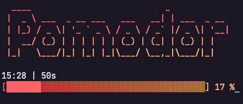

<h1 align="center">
	<br>
	<br>
	
	<br>
	<br>
	<br>
</h1>

> Pomodoro timer CLI

[](https://www.npmjs.com/package/pomodor)
[](https://www.npmjs.com/package/pomodor)
[](https://www.npmjs.com/package/pomodor?activeTab=dependents)



<br>

---

<br>

## Features

- Default pomodoro values (work, break, coffee)
- Custom pomodoro timer based in minutes
- System notification
- Sound notification
- Clean and focused

## Install

```sh
npm install -g pomodor
```

## Direct usage

```sh
npx pomodor --cycle work
```

### CLI Quickstart

```shell
pomodor --cycle 30 \ # value to start the pomodoro in minutes
  --title "Hello Timer" \ # title for your pomodoro
  --description "Hi notification" \ # description for your pomodoro
  --style morning \ # an style for the pomodoro
  --notify \ # enables system notification
  --alert-sound \ # enables sound notification
  --big-title \ # show the giant title
```

## CLI Usage

### CLI Installation

| NPM                                         | Yarn                                   |
| ------------------------------------------- | -------------------------------------- |
| <pre>npm install --global pomodor</pre> | <pre>yarn global add pomodor</pre> |

```text
Usage: pomodor [options]

Pomodoro timer CLI

Options:
  -V, --version              output the version number
  -c, --cycle <value>        Inform a value to start the pomodoro, you can use the following: work, break, coffee or inform the time in minutes ex: 10 (default: "work")
  -t, --title <value>        Enter a title for your pomodoro (default: "Initialized Pomodoro")
  -d, --description <value>  Enter a description for your pomodoro (default: "Lets Go")
  -s, --style <value>        Enter a style for the pomodoro, you can use the following: rainbow ,morning, pastel, mind or retro (default: "morning")
  -bt, --big-title           Show the title of the giant pomodoro
  -as, --alert-sound         Enable sound when completing pomodoro
  -nt, --notify              Enable system notification when completing pomodoro
  -h, --help                 display help for command

Examples:
  pomodor --cycle work --title "Hello Timer" --big-title --alert-sound --notify
```

## Contributing

Contribute by opening a pull request. Also, if your pull request contains TypeScript patches or features, you must include relevant unit tests.

## Maintainers

- [Frank Rocha](https://github.com/fsrocha-dev)